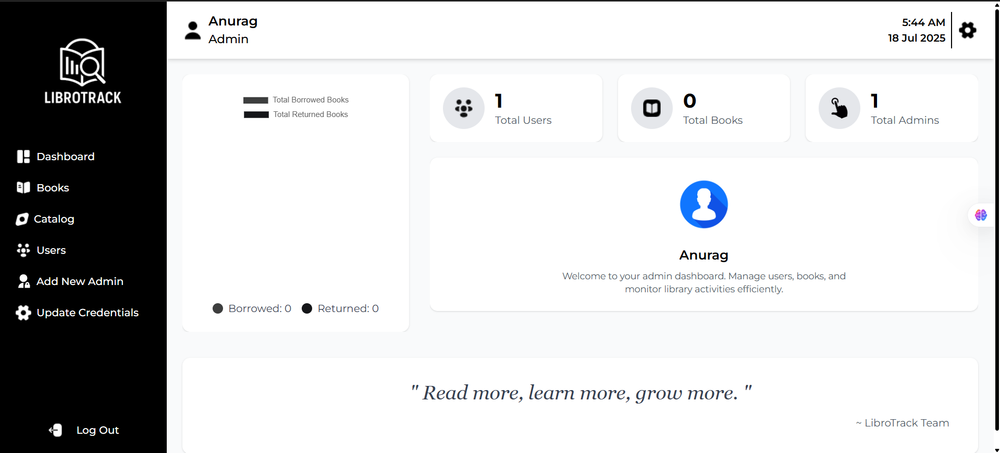
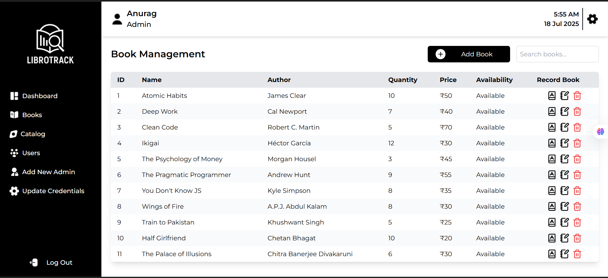
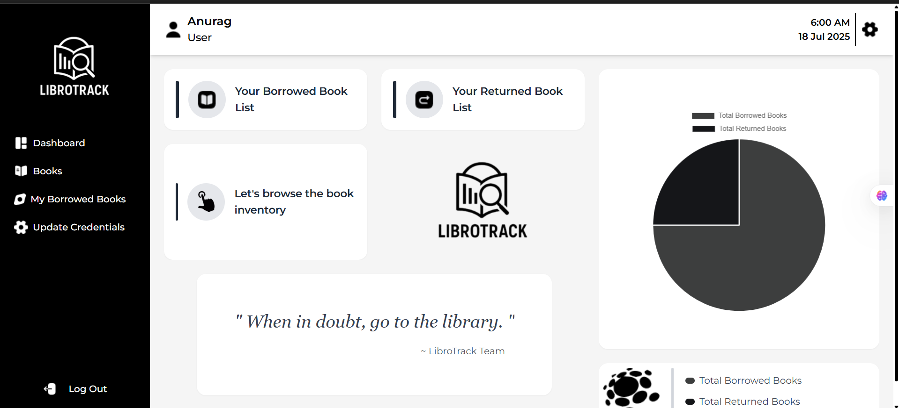

<<<<<<< HEAD
# 📚 LibroTrack

A **full-stack library management system** for managing books, users, and borrow/return records efficiently.

🚀 **Live Demo:** [libro-track.netlify.app](https://libro-track.netlify.app/)

---

## 🖼️ Demo Screenshots





---

## ✨ Features

✅ User Authentication (register, login, reset password, OTP verification)  
✅ Role-based access for Admin and Users  
✅ Add, edit, delete, and manage books (Admin)  
✅ Borrow and return book tracking  
✅ User dashboard for personal borrowed/returned books  
✅ Responsive, clean UI using **React + Tailwind CSS**  
✅ Backend API using **Node.js, Express.js, MongoDB**  
✅ Toast notifications for smooth UX

---

## ⚙️ Tech Stack

- **Frontend:** React, Redux Toolkit, Tailwind CSS
- **Backend:** Node.js, Express.js, MongoDB (Mongoose)
- **Deployment:** Netlify (Frontend), Render (Backend)

---

## 🚀 Getting Started Locally

### 1️⃣ Clone the repository

```bash
git clone https://github.com/Anurag888000/LibroTrack.git
cd LibroTrack
=======
# LibroTrack
Library Management System
>>>>>>> 4dc4aa1f6b02b299ecc46f5aadcceb41e28262fb
